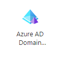

# Day1

I have created an Azure student account for learning Azure.

On Day 1, I have created a Active Directory and ADDS(Azure AD Domain Services).

- Azure Active directory is quite different from normal active directory, Microsoft AAD provides Identity as a service .
- Creation of managed domain is very simple, Search for AADS in Azure services, you will find the below icon 

## Instructions for creation of Domain
1. Click on create domain.
2. Select Subscription and Resource Group, if there is no resource group click on create new.
3. Give the dns domain name, that you want to create, I have created something like domains.local
4. Provide the location and SKU(Standard, Enterprise, Premium), The basic one or standard one is fine for everything that we are going to test, if you want something that can be used to establish trusts between multiple trusts then select enterprise or premium.
5. Click deploy **Hurray**

