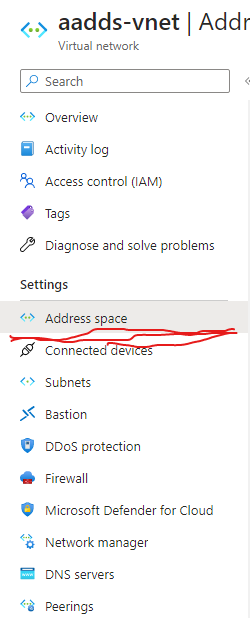
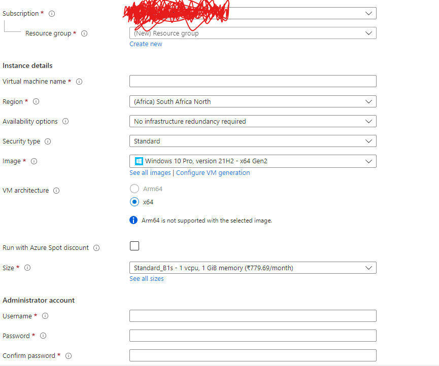
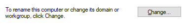
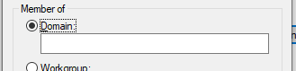

# Day2

Let's continue on day 2 of the Azure learning. Today, let's try to add a host to the domain.
Before adding hosts to the domain, we need to create a subnet linking the with the ADDS Vnet. (**For some reason host deployed in adds subnet add new NSG[Network security group] and NIC, these configurations are creating problems**)

## Instructions to create a linking subnet with adds
1. As part of ADDS creation an NSG was created along with AADDS Vnet and two NICs for DNS servers, Let's go to AADDS Vnet and create a new subnet in subnets section. *The new subnet should not collide with existing aadds-subnet.*
2. I have created a subnet 10.0.2.0/24, Now let's include that subnet in address space [^1]. Options: [Nat Gateway: None, Network security group: None, Route table: None], Specify only name and address range.

Let's create a windows VM host in the existing subnet and add it to the domain.

## Instructions for adding a host to the created subnet.

1. Creating a Virtual machine by clicking create resource or virtual machines in the shortcut. [^2]. Provide the username password and other settings.
2. Go tot the Networking tab, select the Vnet as aads-vnet and subnet as new subnet previously created. 
3. For connecting to VM, You can allow the RDP and public IP or you can deploy azure bastion to avoid the risk.
4. Click Review and create. Now deploy the machine.

Let's add the deployed host to the domain.

## Instructions for adding the host to the created the domain.

1. Login into the host by RDP if allowed or by Azure bastion.
2. click on about, followed by Rename this PC(Advanced).
3. Click on change in computer name.[^3] , Change member of option to domain and provide the domain name that was created before.[^4]
4. It will ask for AD username and password, provide them and it will be connected and asks for a restart.

[^1]: The address space for a virtual network is composed of one or more non-overlapping address ranges .    
-----------------------------------------------------------------------
[^2]: 
[^3]:  
[^4]: 